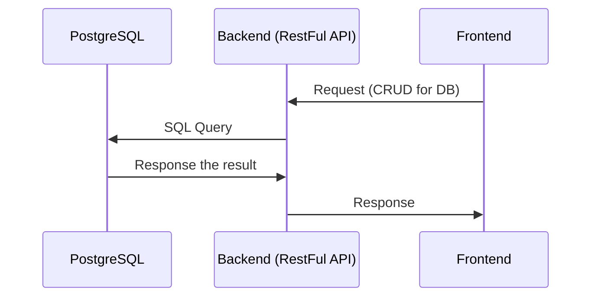

# 球館管理系統 系統設計

## 系統功能
1. 球館會員資料維護
2. 運動用品購物介面
3. 球館活動通知

## 系統設計
### 系統開發語言與框架
前端 React / next.js / CSS / Tailwind CSS

後端 TypeScript / JavaScript (framework使用express.js)

資料庫 PostgreSQL / DBMS pgAdmin

使用docker與Kubernetes架設系統

